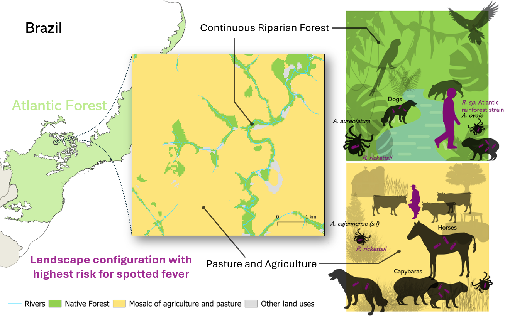

Data and Rcode repository of the study: **"Can landscape management provide disease regulation services? A case study with the Brazilian spotted fever incidence."**

**Graphical abstract**\

**Abstract**\
Brazilian spotted fever (BSF) is a vector-borne disease transmitted by ticks and is a concerning and highly lethal zoonosis in Brazil. Land use changes and the remaining landscape structure can affect BSF risk by increasing the spatial overlap between vectors, hosts and humans. Climate may also have a role in the disease transmission as it drives host distribution. However, little is known about which factors are important in mediating this risk, especially in the Brazilian Atlantic Forest. This study had the goals to fill this research gap and characterize the effects of landscape changes on BSF incidence, and in particular, to assess which landscape features promote high BSF incidence levels. By using a large dataset of BSF incidence collected between 2001 and 2019, and generalized linear mixed models with landscape structure, elevation and climate parameters, our results showed that BSF cases have increased over the last two decades, with most of them located in the Atlantic Forest. BSF incidence also showed a positive relationship with less fragmented landscapes, especially when composed by riparian forests immersed in mosaic of pasture and agriculture matrices. BSF cases also tend to be higher in municipalities where the annual mean temperature is colder. Our results can help prioritize surveillance and the implementation of preventive measures, particularly in areas where landscape structures cannot provide disease regulation services. Landscape management actions aimed at increasing the amount of forest areas in a more aggregated approach could help return those services and build healthy landscapes for people.
