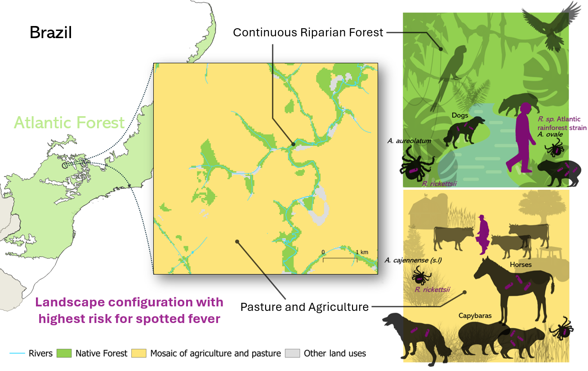

Data and Rcode repository of the study: **"Can landscape management provide disease regulation services? A case study of Brazilian spotted fever incidence."**

**Graphical abstract**\

**Abstract**

1. Brazilian spotted fever (BSF) is a vector-borne disease transmitted by ticks and is a concerning and highly lethal zoonosis in Brazil. Land use changes and the remaining landscape structure can affect BSF risk by increasing the spatial overlap between vectors, hosts and humans. Climate may also have a role in the disease transmission as it drives host and vector distribution. However, little is known about which factors are important in mediating the disease risk, especially in the Brazilian Atlantic Forest. This study aimed to fill this gap and characterize the effects of landscape changes on BSF incidence, particularly by assessing which landscape features promote high BSF incidence levels. 

2.	Generalized linear mixed models were fitted using a large dataset of BSF incidence collected between 2001 and 2019, with relevant landscape structure and climate parameters. Then, a model selection was performed using the Akaike Information Criterion (AICc) to highlight the best environmental predictors for BSF incidence.

3. Exploratory analyses indicated that BSF cases have increased over the last two decades, with most of them located in the Atlantic Forest.
 

4. The results showed a positive relationship between BSF incidence and less fragmented landscapes, especially landscapes composed of riparian forests immersed in mosaics of pastoral and agricultural matrices. BSF cases also tend to be higher in municipalities where the annual mean temperature is lower. 

5. <em>Policy implications.</em> Our results can help prioritize surveillance strategies and the implementation of preventive measures, particularly in areas where landscape structures cannot provide disease regulation services. Landscape management actions aimed at increasing the amount of forest areas in a more aggregated manner could help restore those regulation services and build healthier landscapes for people. Indeed, the results suggest that current environmental laws in the Brazilian Atlantic Forest, focusing on riparian forest restoration, could increase BSF risk. Instead, restoration efforts should prioritize forest regeneration near remaining old-growth forests along with pristine forest conservation. Understanding the landscape context and history is key in restoration planning to maximize benefits while accounting for zoonosis risks.

